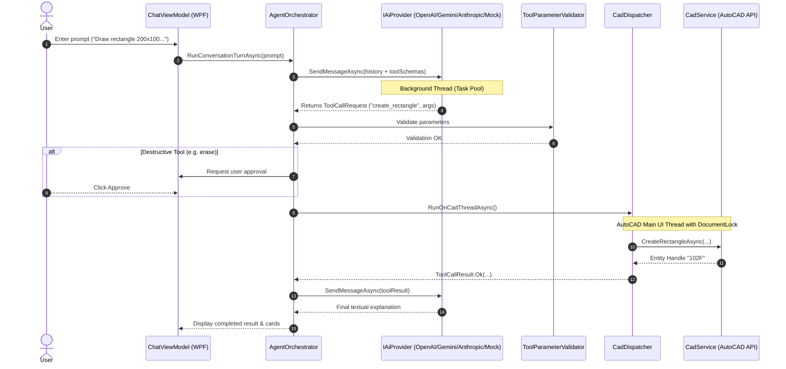

# Autocat Architecture & Technical Design

## 1. Architectural Philosophy

```
LLM (AI Provider) = Natural Language Understanding & Planning
C# (.NET Core & Cad Engine) = Deterministic Geometry, Schema Validation & Atomic Execution
```

The AI model is strictly prohibited from generating raw executable scripts (e.g. C# expressions, AutoLISP, or PowerShell). Instead, all CAD interactions are mediated through a strongly typed, whitelisted Tool calling interface.

---

## 2. Layered Solution Structure

```
Autocat/
├── AutoCadAiPlugin/                  # AutoCAD Entry Point, Ribbon & PaletteSet Host
├── AutoCadAiPlugin.Core/             # Pure Domain Models, Contracts, Interfaces & Enums
├── AutoCadAiPlugin.Cad/              # Native AutoCAD Database, Editor & Transaction Engine
├── AutoCadAiPlugin.Tools/            # 30+ Whitelisted CAD Tool Implementations & Geometry Calculators
├── AutoCadAiPlugin.AI/               # OpenAI, Gemini, Anthropic & Mock Adapters + Agent Orchestrator
├── AutoCadAiPlugin.Infrastructure/   # DPAPI Secret Vault, Logger, Settings & Unit Converters
├── AutoCadAiPlugin.UI/               # Modern WPF MVVM Views, ViewModels, Themes & RTL Support
└── AutoCadAiPlugin.Tests/            # Automated Unit & Integration Tests (xUnit)
```

---

## 3. Execution Pipeline & Threading Model



---

## 4. Transaction Safety & Atomic Rollback

- **Document Locking**: Operations start with `using var docLock = doc.LockDocument()` to prevent concurrent modification conflicts.
- **Transactions**: Executed within `using var tr = db.TransactionManager.StartTransaction()`. If any unexpected exception occurs during entity creation, `tr.Abort()` is automatically triggered, leaving the DWG file in its clean prior state.
- **Undo Groups**: Multi-entity commands are bundled so that users can revert the entire AI step with a single AutoCAD `UNDO`.
